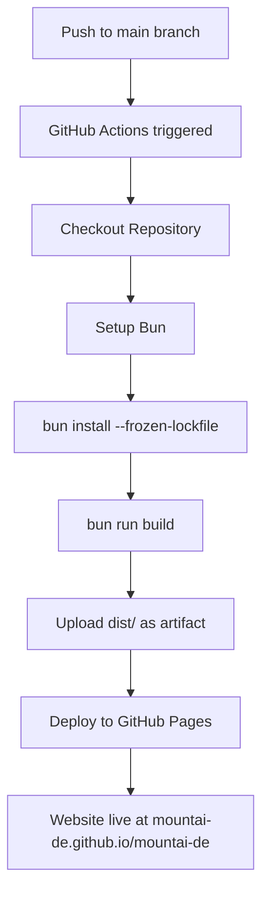

# GitHub Pages Deployment Plan

## Zusammenfassung

Die Website soll auf `https://mountai-de.github.io/mountai-de` bereitgestellt werden.

## Identifizierte Probleme

1. **GitHub Actions Workflow** verwendet `npm ci`, aber nur `bun.lock` existiert
2. **CNAME-Datei** enthält `www.mountai.de` - muss entfernt werden für github.io Test
3. **astro.config.mjs** hat `site: 'https://mountai.de'` - muss auf GitHub Pages URL geändert werden

## Geplante Änderungen

### 1. GitHub Actions Workflow auf Bun umstellen

**Datei:** `.github/workflows/deploy-pages.yml`

```yaml
name: Deploy to GitHub Pages

on:
  push:
    branches: [main]
  workflow_dispatch:

permissions:
  contents: read
  pages: write
  id-token: write

jobs:
  build:
    runs-on: ubuntu-latest
    steps:
      - name: Checkout
        uses: actions/checkout@v4

      - name: Setup Bun
        uses: oven-sh/setup-bun@v2
        with:
          bun-version: latest

      - name: Install dependencies
        run: bun install --frozen-lockfile

      - name: Build Astro
        run: bun run build

      - name: Upload Pages artifact
        uses: actions/upload-pages-artifact@v3
        with:
          path: ./dist

  deploy:
    needs: build
    runs-on: ubuntu-latest
    environment:
      name: github-pages
      url: ${{ steps.deployment.outputs.page_url }}
    steps:
      - name: Deploy to GitHub Pages
        id: deployment
        uses: actions/deploy-pages@v4
```

**Änderungen:**
- `actions/setup-node@v4` → `oven-sh/setup-bun@v2`
- `npm ci` → `bun install --frozen-lockfile`
- `npm run build` → `bun run build`

### 2. astro.config.mjs anpassen

**Datei:** `astro.config.mjs`

```javascript
// @ts-check
import { defineConfig } from 'astro/config';

// https://astro.build/config
export default defineConfig({
  site: 'https://mountai-de.github.io',
  base: '/mountai-de',
  output: 'static',
});
```

**Änderungen:**
- `site` von `https://mountai.de` auf `https://mountai-de.github.io` ändern
- `base: '/mountai-de'` bleibt korrekt

### 3. CNAME-Datei entfernen

**Datei:** `public/CNAME`

Diese Datei muss gelöscht werden, da sie nur für Custom Domains benötigt wird.

## Ablaufdiagramm



## Nach dem Deployment

Sobald GitHub Pages funktioniert, können wir:

1. **Custom Domain hinzufügen** - CNAME zurück mit `mountai.de`
2. **astro.config.mjs** auf `site: 'https://mountai.de'` und `base: '/'` ändern
3. **Coolify** als Alternative konfigurieren

## Voraussetzungen auf GitHub

Stelle sicher, dass in den Repository-Einstellungen:
1. **Settings → Pages → Source** auf "GitHub Actions" gesetzt ist
2. GitHub Pages aktiviert ist
