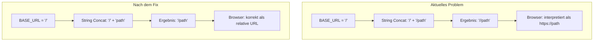

# Fix-Plan: Doppelte Slashes in Pfaden

## Problem-Zusammenfassung

Die Website auf Coolify (https://mountai.de) hat fehlerhafte Pfade, die zu folgenden Problemen führen:
- ❌ Favicon wird nicht geladen
- ❌ Schriftarten werden nicht geladen (Fallback auf System-Fonts)
- ❌ Impressum/Datenschutz Links führen zu `https://impressum` statt `https://mountai.de/impressum`

### Browser-Fehlermeldungen
```
GET https://fonts/Anthro-Sans-Roman.woff2 net::ERR_NAME_NOT_RESOLVED
GET https://fonts/Anthro-Serif-Roman.woff2 net::ERR_NAME_NOT_RESOLVED
GET https://favicon.svg/ net::ERR_NAME_NOT_RESOLVED
```

## Root Cause

Das Problem liegt in der `BaseLayout.astro` Datei, wo Pfade wie folgt konstruiert werden:

```javascript
const baseUrl = import.meta.env.BASE_URL;
// ...
href={`${baseUrl}/favicon.svg`}  // Ergibt: //favicon.svg bei BASE_URL="/"
```

**Astro's `BASE_URL` enthält einen trailing slash:**
- Coolify: `BASE_URL` = `/` (ein Slash)
- GitHub Pages: `BASE_URL` = `/mountai-de/` (mit Slash am Ende)

**Wenn man dann `${baseUrl}/path` schreibt:**
- Coolify: `"/" + "/favicon.svg"` = `//favicon.svg` → Browser interpretiert als `https://favicon.svg`
- GitHub Pages: `"/mountai-de/" + "/favicon.svg"` = `/mountai-de//favicon.svg` → funktioniert trotzdem

## Lösung

**Option A: Trailing Slash entfernen (empfohlen)**

Alle Pfad-Konstruktionen von:
```javascript
href={`${baseUrl}/path`}
```
ändern zu:
```javascript
href={`${baseUrl}path`}  // Kein Slash vor dem Pfad
```

**Option B: Astro's Nicht-Slash BASE_PATH verwenden**

In `astro.config.mjs` `trailingSlash: 'never'` setzen, aber das kann andere Nebeneffekte haben.

## Betroffene Stellen in BaseLayout.astro

| Zeile | Aktuell | Korrigiert |
|-------|---------|------------|
| 28 | `href={\`${baseUrl}/favicon.svg\`}` | `href={\`${baseUrl}favicon.svg\`}` |
| 35 | `url('${baseUrl}/fonts/Anthro-Serif-Roman.woff2')` | `url('${baseUrl}fonts/Anthro-Serif-Roman.woff2')` |
| 45 | `url('${baseUrl}/fonts/Anthro-Sans-Roman.woff2')` | `url('${baseUrl}fonts/Anthro-Sans-Roman.woff2')` |
| 57 | `href={baseUrl}` | ✅ Bereits korrekt (ist die Root-URL) |
| 71 | `href={\`${baseUrl}/impressum\`}` | `href={\`${baseUrl}impressum\`}` |
| 72 | `href={\`${baseUrl}/datenschutz\`}` | `href={\`${baseUrl}datenschutz\`}` |

## Architektur-Diagramm



## Zur Frage: ENV-Variablen vs. Zwei Branches

### Option 1: Dynamische ENV-Variablen (aktueller Ansatz)

**Vorteile:**
- ✅ Eine Codebasis für beide Deployments
- ✅ Änderungen wirken sich automatisch auf beide aus
- ✅ Standard-Pattern in der Industrie

**Nachteile:**
- ⚠️ Erfordert korrekte ENV-Konfiguration in Coolify
- ⚠️ Pfad-Bugs wie dieser können auftreten

### Option 2: Zwei separate Branches

**Vorteile:**
- ✅ Vollständige Trennung - keine ENV-Abhängigkeit
- ✅ Einfacher zu debuggen
- ✅ Hardcoded Werte - weniger Fehlerquellen

**Nachteile:**
- ❌ Doppelte Wartung - Änderungen müssen in beide Branches
- ❌ Merge-Konflikte möglich
- ❌ Höherer Aufwand bei Änderungen

### Empfehlung

**Bleibe beim ENV-Variablen-Ansatz**, aber fixe die Pfad-Konstruktion. Das ist die sauberere und wartbarere Lösung. Das aktuelle Problem ist nur ein kleiner Bug in der String-Concatenation, nicht ein Problem des Ansatzes selbst.

## Nächste Schritte

1. **Code-Fix in BaseLayout.astro** - Entferne die führenden Slashes bei allen Pfad-Konstruktionen
2. **Lokal testen** mit beiden Konfigurationen:
   ```bash
   # Coolify-Simulation
   SITE_URL=https://mountai.de BASE_PATH=/ bun run build && bun run preview
   
   # GitHub Pages-Simulation
   SITE_URL=https://mountai-de.github.io BASE_PATH=/mountai-de bun run build && bun run preview
   ```
3. **Commit & Push** → GitHub Actions deployt zu GitHub Pages
4. **Coolify Re-Deploy** → Webhook oder manuell auslösen

## Geschätzte Änderungen

- **1 Datei betroffen**: `src/layouts/BaseLayout.astro`
- **6 Zeilen zu ändern**: Zeilen 28, 35, 45, 71, 72 (und ggf. weitere)
- **Risiko**: Niedrig - reine String-Anpassung
